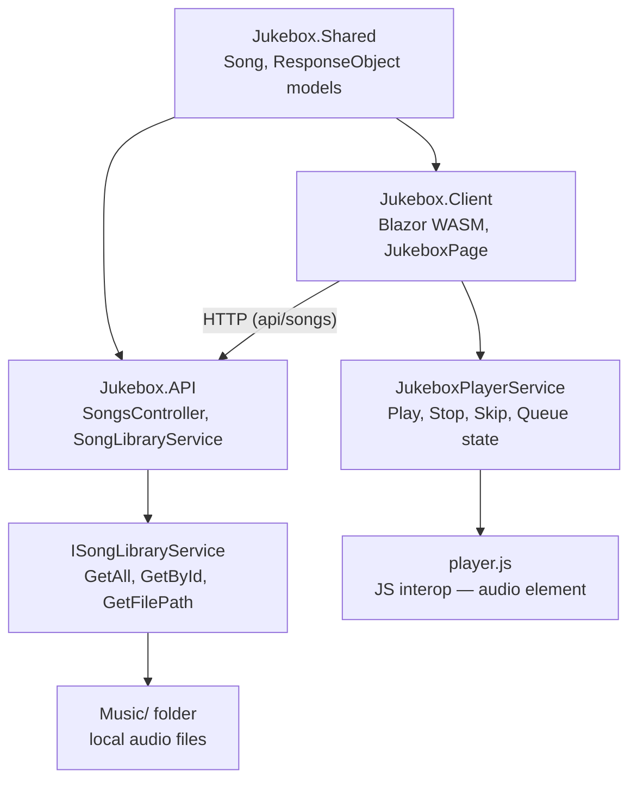
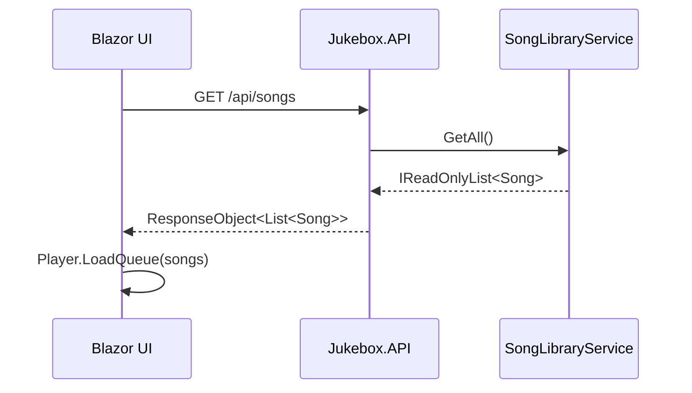
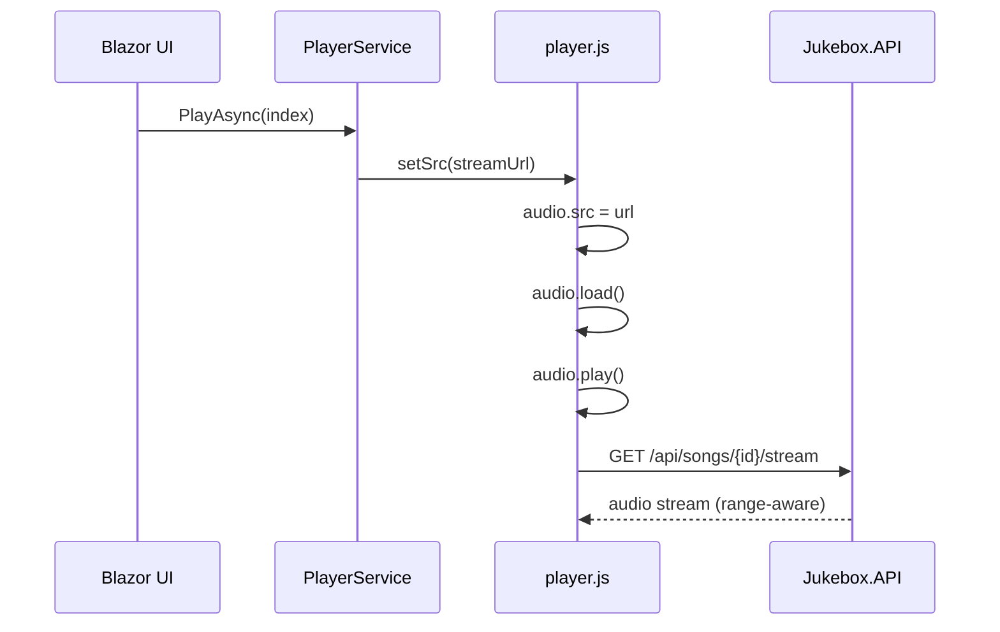
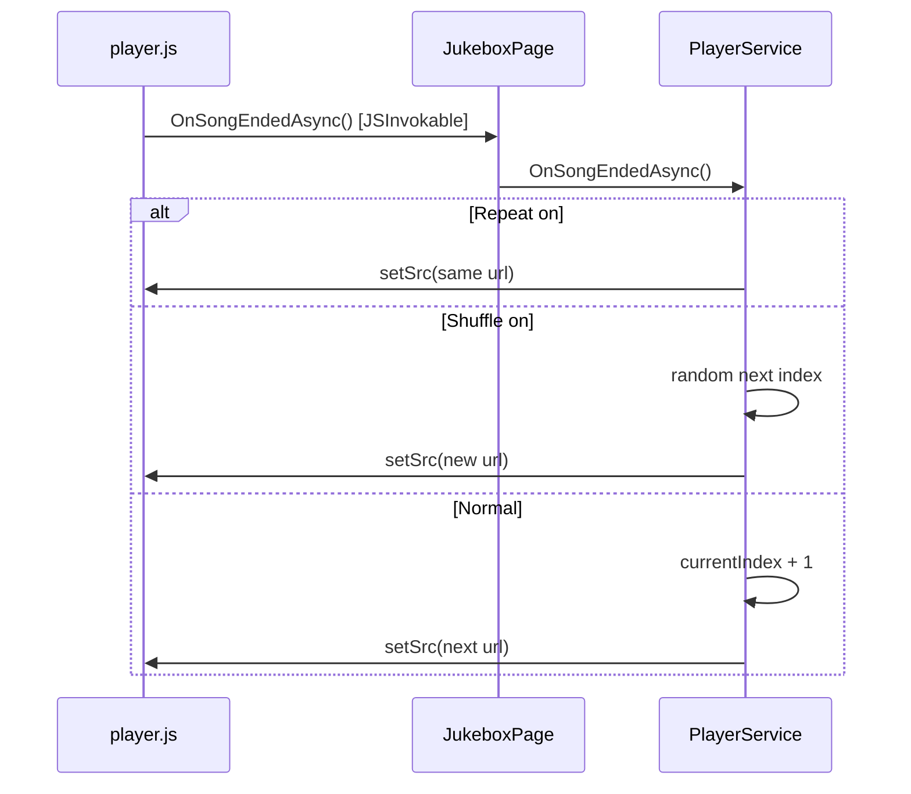
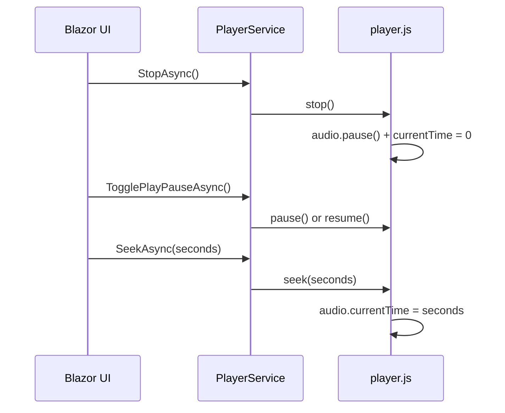
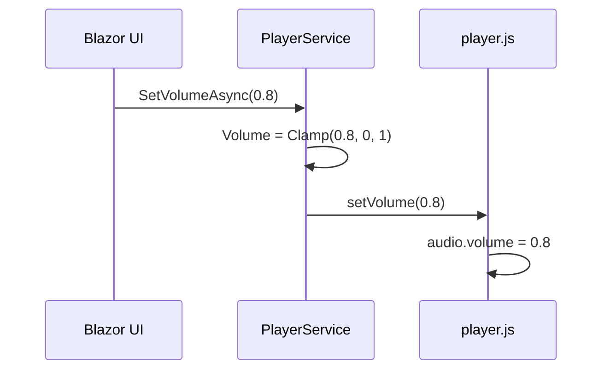

# 🎵 Jukebox

A .NET 8 Web API + Blazor WebAssembly jukebox app. Drop local audio files in, hit play.

## Solution Structure

```
Jukebox.sln
├── Jukebox.Shared      — Song model (shared between API + Client)
├── Jukebox.API         — .NET Core Web API (serves song list + audio streams)
└── Jukebox.Client      — Blazor WebAssembly SPA (jukebox UI)
```

## Quick Start

### 1. Add your music

Drop audio files into `Jukebox.API/Music/`.

Supported formats: `.mp3`, `.wav`, `.ogg`, `.flac`, `.aac`, `.m4a`

**Optional naming convention** — the library auto-parses filenames:
```
Artist - Title.mp3          →  Artist: "Artist",  Title: "Title"
SomeSong.mp3                →  Artist: "Unknown Artist", Title: "SomeSong"
```

### 2. Run the API

```bash
cd Jukebox.API
dotnet run
# Listening on https://localhost:7001
```

### 3. Run the Blazor client

```bash
cd Jukebox.Client
dotnet run
# Open https://localhost:7002
```

Both projects can be run simultaneously from Visual Studio by setting multiple startup projects.

---

## API Endpoints

| Method | Route                    | Description                          |
|--------|--------------------------|--------------------------------------|
| GET    | `/api/songs`             | Returns full song list               |
| GET    | `/api/songs/{id}`        | Returns a single song by ID          |
| GET    | `/api/songs/{id}/stream` | Streams the audio file (range-aware) |

The stream endpoint supports HTTP range requests, so the browser can seek freely.

---

## Features

- ▶ Play / ⏸ Pause / ⏹ Stop
- ⏮ Previous track (restarts current if >3 seconds in)
- ⏭ Skip to next
- ↺ Repeat current track
- ⇄ Shuffle mode
- Progress bar with click-to-seek
- Volume control
- Spinning disc animation while playing
- Auto-advance to next track on song end
- Song queue — click any track to play immediately

---

## Configuration

The music folder path is configurable in `Jukebox.API/appsettings.json`:

```json
{
  "MusicFolder": "Music"
}
```

Use an absolute path to point at any folder on disk:
```json
{
  "MusicFolder": "C:\\Users\\You\\Music"
}
```

The API base URL for the Blazor client is set in `Jukebox.Client/Program.cs`:
```csharp
BaseAddress = new Uri("https://localhost:7001")
```

Change this if you deploy the API elsewhere.

---

## Architecture Notes

- Audio playback is handled entirely by the browser's native `<audio>` element.
- Blazor communicates with it via JS interop (`wwwroot/js/player.js`).
- The `JukeboxPlayerService` is a scoped service holding all player state; components subscribe to its `StateChanged` event to re-render.
- The API uses `PhysicalFile(..., enableRangeProcessing: true)` so the browser can seek without downloading the whole file.


# Jukebox — Architecture Diagrams

## Solution Structure


---

## Flow 1 — App load: fetch song list


---

## Flow 2 — User plays a song


---

## Flow 3 — Song ends: auto-advance


---

## Flow 4 — Stop / Pause / Seek


---

## Flow 5 — Volume change

Model used:
Claude: Sonnet 4.6
